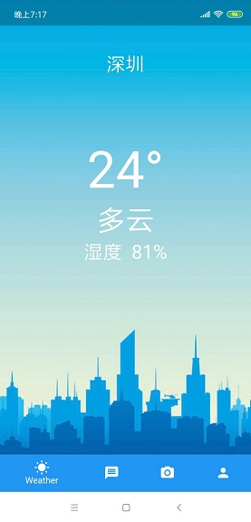
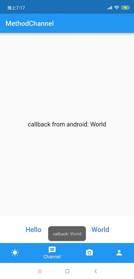
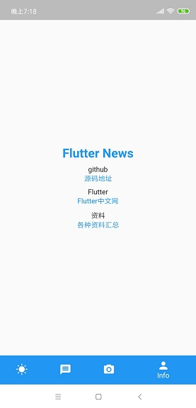
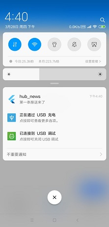

# hub_news

A new Flutter application.

#### Summary

已经实现以下功能

1. 实况天气：网络请求相关
2. 客户端toast：通过MethodChannel方式实现，目前只支持Android，iOS不会
3. 相机：通过pub plugin的方式调用客户端原生硬件
4. 个人中心页：Flutter相关资料，github地址（用于求star）
5. 推送

#### 详细说明

##### TAB 1: 实况天气

* 网络库
* 请求 和风天气 API

##### TAB 2：通过Channel调用Toast（目前只实现Android）

* MethodChannel实现Flutter层与客户端层的通知
* 需要在Android及iOS端都实现相关代码

##### TAB 3 : 通过pub仓库上的plugin拉客户端的相机（Android iOS均支持）

* plugin已经实现了相关逻辑，这里直接调用接口拿回调

##### TAB 4 : 个人中心

* 一些资料
* github地址，求star

##### 其他 ： 推送

